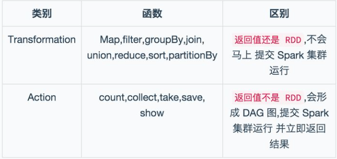
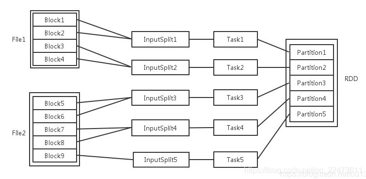
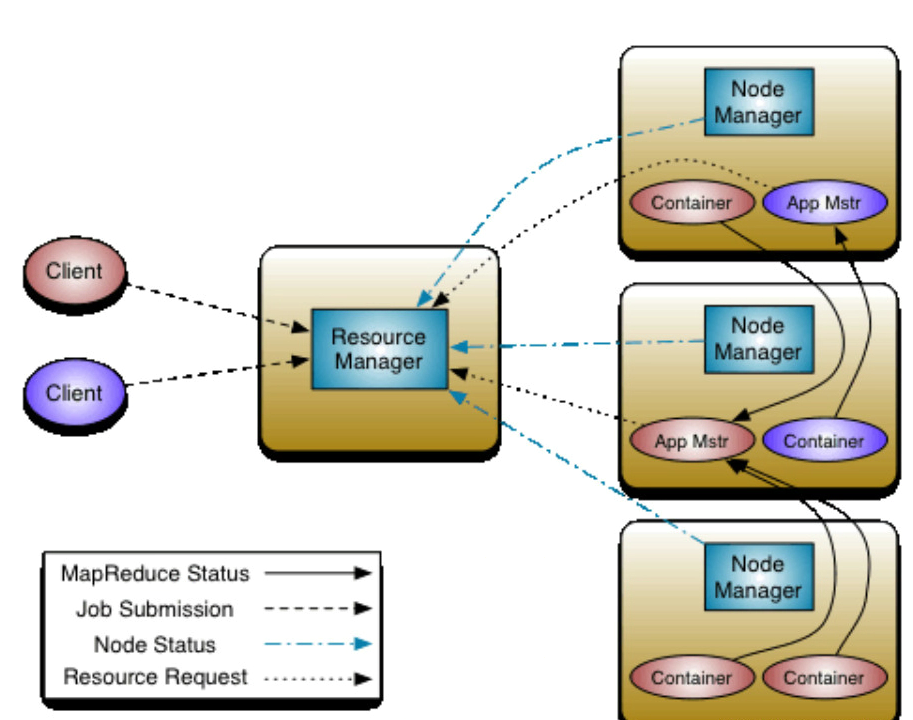

批处理、流处理框架：

# Spark

成员：

    1、Driver： 运行Application 的main()函数
    
    2、Cluster Manager：在standalone模式中即为Master主节点，控制整个集群，监控worker。在YARN模式中为资源管理器
    
    3、Worker节点：从节点，负责控制计算节点，启动Executor或者Driver。
    
    4、Executor：执行器，是为某个Application运行在worker node上的一个进程

1、RDD：弹性分布式数据集,是 Spark 底层的分布式存储的数据结构, Spark API 的所有操作都是基于 RDD 的。

1.它是在集群节点上的不可变的、已分区的集合对象;（只读）

2.通过并行转换的方式来创建(如 Map、 filter、join 等);

2、RDD 的操作函数(operation)主要分为2种类型 Transformation 和 Action.

Transformation 操作不是马上提交 Spark 集群执行的, Transformation 操作时只会记录操作,并不会去执行,需要等到有 Action 操作才会计算，生产一个job。所有的操作生成一个有向无环图DAG。

3、shuffle 是划分 DAG 中 stage 的标识,同时影响 Spark 执行速度的关键步骤.

shuffle 如果把数据重新分配到内存中，容易造成OutOfMemory。

Job=多个stage，Stage=多个同种task, Task分为ShuffleMapTask和ResultTask

4、Cache缓存，spark本来就是基于内存的计算，只有一个 Action 操作且子 RDD 只依赖于一个父RDD 的话,就不需要使用 cache 这个机制。

当存在多个 Action 操作或者依赖于多个 RDD 的时候, 可以在那之前缓存RDD。

RDD 读取文件：

    当Spark读取这些文件作为输入时，会根据具体数据格式对应的InputFormat进行解析，一般是将若干个Block合并成一个输入分片，称为	InputSplit	，注意InputSplit不能跨越文件。
    
    InputSplit与Task是一一对应的关系。
    
    每个节点可以起一个或多个Executor。
    
    每个Executor由若干core组成，每个Executor的每个core一次只能执行一个Task。
    
    每个Task执行的结果就是生成了目标RDD的一个partiton。

注意： 这里的core是虚拟的core而不是机器的物理CPU核，可以理解为就是Executor的一个工作线程。

Task被执行的并发度 = Executor数目 * 每个Executor核数（=core总个数）

RDD的每个元素是partition，分布在不同的机器中

# YARN

Yet Another Resource Negotiator，另一种资源协调者，是一种新的 Hadoop 资源管理器。把 yarn 理解为相当于一个分布式的操作系统平台，而 mapreduce 等运算程序则相当于运行于操作系统之上的应用程序，Yarn 为这些程序提供运算所需的资源（内存、cpu）。

### 特点

    1. yarn 并不清楚用户提交的程序的运行机制
    2. yarn 只提供运算资源的调度（用户程序向 yarn 申请资源，yarn 就负责分配资源）
    3. yarn 上可以运行各种类型的分布式运算程序,符合 yarn 规范的资源请求机制即可
### 模块

    * ResourceManager ：负责整个集群所有资源的监控、分配和管理；
    * NodeManager ：每个节点上的资源和任务管理器，它是管理这台机器的代理，负责该节点程序的运行，每个节点一个NM。
    * ApplicationMaster ：负责每一个具体应用程序的调度和协调；负责与 RM 调度器协商以获取资源，与 NM 通信以启动/停止任务。

ps：Container是YARN里面资源分配的基本单位，具有一定的内存以及CPU资源。我们的应用在工作的时候，需要消耗内存和CPU，故当YARN收到application申请，则会根据application申请的资源，分配Container。

### 调度器 Scheduler

在 Yarn 中，负责给应用分配资源的就是 Scheduler。

三种调度器可以选择：

    1、FIFO Scheduler ，
    
    2、Capacity Scheduler，多个组织共享整个集群,每个组织分配专门的队列和一定的集群资源。
    
    3、Fair Scheduler，为所有运行的 job 动态的调整系统资源，即按比例分配，动态调整。
    

# HDFS

# HIVE
    hive数据仓库工具能将结构化的数据文件映射为一张数据库表，并提供SQL查询功能，能将SQL语句转变成MapReduce任务来执行。
    
    1）hive是sql语言，通过数据库的方式来操作hdfs文件系统，为了简化编程，底层计算方式为mapreduce。
    
    2）hive是面向行存储的数据库。
    
    3）Hive本身不存储和计算数据，它完全依赖于HDFS和MapReduce，Hive中的表只是逻辑。

hive 和 hbase的区别

不严格的ps：

    hive可以认为是map-reduce的一个包装。hive的意义就是把好写的hive的sql转换为复杂难写的map-reduce程序。
    hbase可以认为是hdfs的一个包装。他的本质是数据存储，是个NoSql数据库；hbase部署于hdfs之上，并且克服了hdfs在随机读写方面的缺点。

hive不是数据库，只是由于SQL被广泛的应用在数据仓库中，因此，专门针对Hive的特性设计了类SQL的查询语言HQL。

Hive 是建立在 Hadoop 之上的，所有 Hive 的数据都是存储在 HDFS 中的。而数据库则可以将数据保存在块设备或者本地文件系统中。

