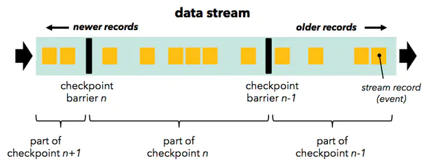

# Flink
Client：提交任务-----Spark中的Driver

JobManager：管理任务----Spark中的Master

TaskManager：执行任务----Spark中的Worker/Exector

### 流程：

### Flink On Yarn的执行流程：

1、首先客户端往HDFS上传Flink任务的jar包和相关配置

2、然后客户端还要向Yarn的ResourceManager提交任务和申请资源

3、ResourceManager开始分配Container资源并且启动ApplicationMaster

4、ApplicationMaster加载Flink的任务jar包和配置构建环境启动JobManager

5、ApplicationManager向ResourceManager申请资源

6、NodeMananger加载Flink任务的jar包和配置构建环境启动TaskManager

7、TaskManager启动后向JobManager发送心跳包，并且等待JobManager向它分配任务

### Flink 容错机制
对于一个分布式系统，节点或者单个进程失败是常有的事，不丢失数据的容错机制就变得重要。

批处理：文件可以重复访问，失败重启即可

流处理：由于数据源是无限的数据流，一个任务执行几个月的情况，将所有数据缓存或是持久化，留待以后重复访问基本上是不可行的。

#### checkPoints
基于分布式快照与可部分重发的数据源实现了容错。

按照用户自定义的分布式快照间隔时间，Flink会定时在所有数据源中插入一种特殊的快照标记消息，这些快照标记消息和其他消息一样在DAG中流动，但是不会被用户定义的业务逻辑所处理，每一个快照标记消息都将其所在的数据流分成两部分：本次快照数据和下次快照数据。

