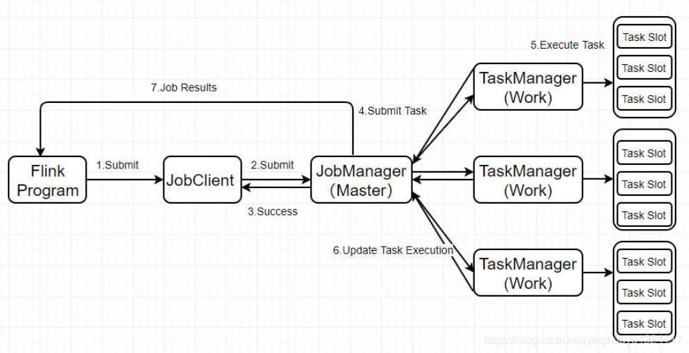

# Flink
Client：提交任务-----Spark中的Driver

JobManager：管理任务----Spark中的Master

TaskManager：执行任务----Spark中的Worker/Exector

### 流程：

### Flink On Yarn的执行流程：

1、首先客户端往HDFS上传Flink任务的jar包和相关配置

2、然后客户端还要向Yarn的ResourceManager提交任务和申请资源

3、ResourceManager开始分配Container资源并且启动ApplicationMaster

4、ApplicationMaster加载Flink的任务jar包和配置构建环境启动JobManager

5、ApplicationManager向ResourceManager申请资源

6、NodeMananger加载Flink任务的jar包和配置构建环境启动TaskManager

7、TaskManager启动后向JobManager发送心跳包，并且等待JobManager向它分配任务