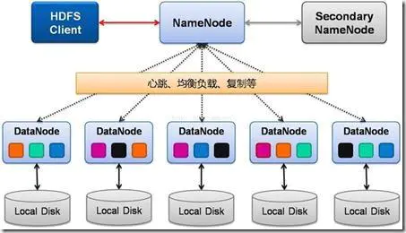

#Hadoop
Hadoop是一个能够对大量数据进行分布式处理的软件框架。 Hadoop 以一种可靠、高效、可伸缩的方式进行数据处理

Hadoop的框架最核心的设计就是：HDFS和MapReduce。

    HDFS: 分布式文件存储
    YARN: 分布式资源管理
    MapReduce: 分布式计算
    Others: 利用YARN的资源管理功能实现其他的数据处理方式

# HDFS

#MapReduce
    分而治之

# YARN

Yet Another Resource Negotiator，另一种资源协调者，是一种新的 Hadoop 资源管理器。把 yarn 理解为相当于一个分布式的操作系统平台，而 mapreduce 等运算程序则相当于运行于操作系统之上的应用程序，Yarn 为这些程序提供运算所需的资源（内存、cpu）。

### 特点

    1. yarn 并不清楚用户提交的程序的运行机制
    2. yarn 只提供运算资源的调度（用户程序向 yarn 申请资源，yarn 就负责分配资源）
    3. yarn 上可以运行各种类型的分布式运算程序,符合 yarn 规范的资源请求机制即可
### 模块

    * ResourceManager ：负责整个集群所有资源的监控、分配和管理；
    * NodeManager ：每个节点上的资源和任务管理器，它是管理这台机器的代理，负责该节点程序的运行，每个节点一个NM。
    * ApplicationMaster ：负责每一个具体应用程序的调度和协调；负责与 RM 调度器协商以获取资源，与 NM 通信以启动/停止任务。

ps：Container是YARN里面资源分配的基本单位，具有一定的内存以及CPU资源。我们的应用在工作的时候，需要消耗内存和CPU，故当YARN收到application申请，则会根据application申请的资源，分配Container。

### 调度器 Scheduler

在 Yarn 中，负责给应用分配资源的就是 Scheduler。

三种调度器可以选择：

    1、FIFO Scheduler ，
    
    2、Capacity Scheduler，多个组织共享整个集群,每个组织分配专门的队列和一定的集群资源。
    
    3、Fair Scheduler，为所有运行的 job 动态的调整系统资源，即按比例分配，动态调整。

# HIVE
    hive数据仓库工具能将结构化的数据文件映射为一张数据库表，并提供SQL查询功能，能将SQL语句转变成MapReduce任务来执行。
    
    1）hive是sql语言，通过数据库的方式来操作hdfs文件系统，为了简化编程，底层计算方式为mapreduce。
    
    2）hive是面向行存储的数据库。
    
    3）Hive本身不存储和计算数据，它完全依赖于HDFS和MapReduce，Hive中的表只是逻辑。

hive 和 hbase的区别

不严格的ps：

    hive可以认为是map-reduce的一个包装。hive的意义就是把好写的hive的sql转换为复杂难写的map-reduce程序。
    hbase可以认为是hdfs的一个包装。他的本质是数据存储，是个NoSql数据库；hbase部署于hdfs之上，并且克服了hdfs在随机读写方面的缺点。

hive不是数据库，只是由于SQL被广泛的应用在数据仓库中，因此，专门针对Hive的特性设计了类SQL的查询语言HQL。

Hive 是建立在 Hadoop 之上的，所有 Hive 的数据都是存储在 HDFS 中的。而数据库则可以将数据保存在块设备或者本地文件系统中。

