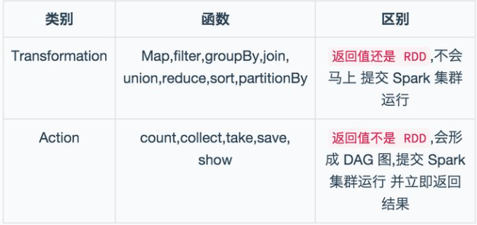
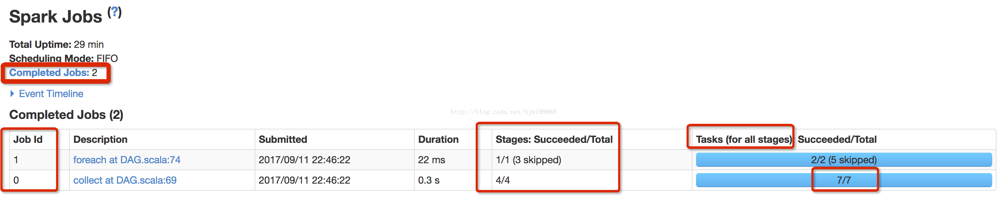
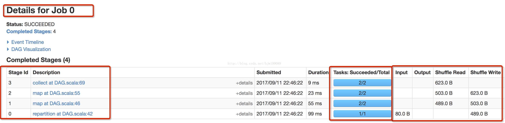
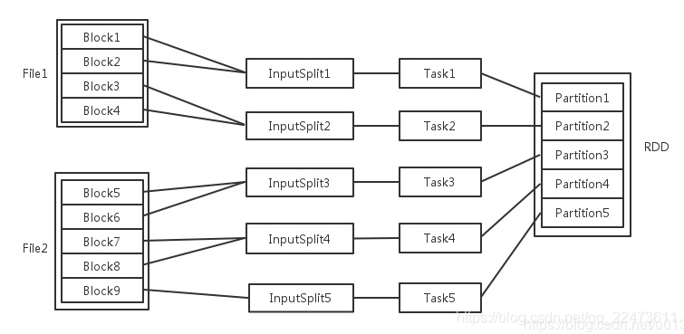
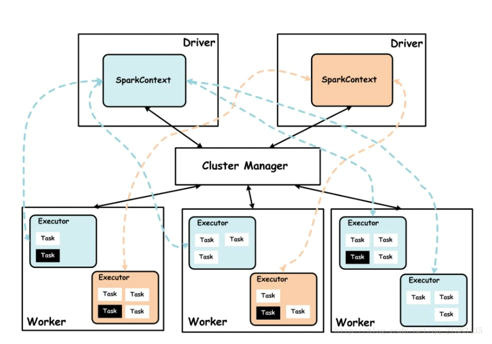
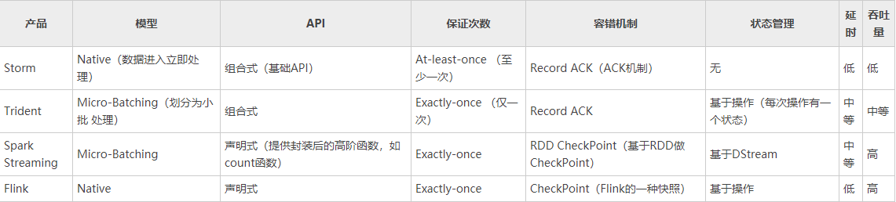

# Spark

#RDD
1、RDD：弹性分布式数据集,是 Spark 底层的分布式存储的数据结构, Spark API 的所有操作都是基于 RDD 的。

2、RDD 的操作函数(operation)主要分为2种类型 Transformation 和 Action.

Transformation 操作不是马上提交 Spark 集群执行的, Transformation 操作时只会记录操作,并不会去执行,需要等到有 Action 操作才会计算，生产一个job。所有的操作生成一个有向无环图DAG。

### spark application逻辑划分：

    · Jobs:DAG图中的 action 的触发会生成一个job, Job会提交给DAGScheduler,分解成Stage, 每个stage形成自己的子DAG图
    · Stage:DAGScheduler 根据shuffle将job划分为不同的stage，同一个stage中包含多个task，这些tasks有相同的 shuffle dependencies。
        有两类shuffle map stage和result stage
    · Task:被送到executor上的工作单元，task简单的说就是在一个数据partition上的单个数据处理流程。
    · Executor：运行在物理节点(Worker Node)上启动的一个进程，执行多个tasks

    · Cache缓存：当存在多个 Action 操作或者依赖于多个 RDD 的时候, 可以在那之前缓存RDD。  
                存在 Executor上和task同级。

从sparkUI上可以看出，一个application 根据代码中的action 分为多个job.

如图：job0有4个stage，共7个task。  
stage0：1个分区有1个task执行  
stage1--3：各有2个分区，各有2个task执行，共6个task  
**ps: Executor的数量是全局配置的， 所有stage中的tasks 共享这些资源，由这些executor去执行task.**

# RDD 数据

    当Spark读取这些文件作为输入时，会根据具体数据格式对应的InputFormat进行解析，一般是将若干个Block合并成一个输入分片，称为	InputSplit	，注意InputSplit不能跨越文件。
    
    InputSplit与Task是一一对应的关系。

### Executor
· 每个节点可以起一个或多个Executor,数量是全局配置的，共享的资源。  
· 每个Executor由若干core组成，每个Executor的每个core一次只能执行一个Task。  
· 每个Task执行的结果就是生成了目标RDD的一个partiton。
ps： 这里的core是虚拟的core而不是机器的物理CPU核，可以理解为就是Executor的一个工作线程。
Task被执行的并发度 = Executor数目 * 每个Executor核数（=core总个数）

###partition / block
· RDD: 弹性分布式数据集,数据量很大,所以是分布式的，被拆分在各个节点分区中，操作rdd实际是操作各个分区.  
· partition: 分区是RDD的最小单元，RDD是由分布在各个节点上的partition 组成的。同一份数据(RDD)的partition 大小不一，数量不定，由算子和数据量决定，所以是弹性的。  
· block :是hdfs分布式存储的最小单元，block文件大小是固定，文件可以由多个block组成。  
   
    block位于存储空间、partition 位于计算空间，
    block的大小是固定的、partition 大小是不固定的，
    block是有冗余的、不会轻易丢失，partition（RDD）没有冗余设计、丢失之后重新计算得到.

#### 分区函数
HashPartition():partition = key.hashCode () % numPartitions. 分布不均容易倾斜。  
RangePartitioner():对key值进行排序，然后将key值被划分成分区份数key值集合。    
CustomPartitioner():自定义方法
#### 分区数
Spark从HDFS读入文件的分区数默认等于HDFS文件的块数(blocks), 即 RDD大小/blocks大小。  
ps：总核数=executor-cores * num-executor  
一般合理的分区数设置为总核数的2~3倍

#全局划分

成员：

    1、Driver： 运行Application 的main()函数
    
    2、Cluster Manager：在standalone模式中即为Master主节点，控制整个集群，监控worker。在YARN模式中为资源管理器
    
    3、Worker节点：从节点，负责控制计算节点，启动Executor或者Driver。

ps:批处理、流处理框架：

