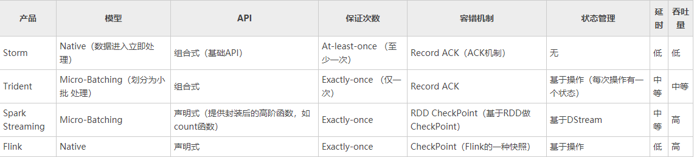

# Spark

成员：

    1、Driver： 运行Application 的main()函数
    
    2、Cluster Manager：在standalone模式中即为Master主节点，控制整个集群，监控worker。在YARN模式中为资源管理器
    
    3、Worker节点：从节点，负责控制计算节点，启动Executor或者Driver。
    
    4、Executor：执行器，是为某个Application运行在worker node上的一个进程

1、RDD：弹性分布式数据集,是 Spark 底层的分布式存储的数据结构, Spark API 的所有操作都是基于 RDD 的。

1.它是在集群节点上的不可变的、已分区的集合对象;（只读）

2.通过并行转换的方式来创建(如 Map、 filter、join 等);

2、RDD 的操作函数(operation)主要分为2种类型 Transformation 和 Action.

Transformation 操作不是马上提交 Spark 集群执行的, Transformation 操作时只会记录操作,并不会去执行,需要等到有 Action 操作才会计算，生产一个job。所有的操作生成一个有向无环图DAG。

3、shuffle 是划分 DAG 中 stage 的标识,同时影响 Spark 执行速度的关键步骤.

shuffle 如果把数据重新分配到内存中，容易造成OutOfMemory。

Job=多个stage，Stage=多个同种task, Task分为ShuffleMapTask和ResultTask

4、Cache缓存，spark本来就是基于内存的计算，只有一个 Action 操作且子 RDD 只依赖于一个父RDD 的话,就不需要使用 cache 这个机制。

当存在多个 Action 操作或者依赖于多个 RDD 的时候, 可以在那之前缓存RDD。

RDD 读取文件：

    当Spark读取这些文件作为输入时，会根据具体数据格式对应的InputFormat进行解析，一般是将若干个Block合并成一个输入分片，称为	InputSplit	，注意InputSplit不能跨越文件。
    
    InputSplit与Task是一一对应的关系。
    
    每个节点可以起一个或多个Executor。
    
    每个Executor由若干core组成，每个Executor的每个core一次只能执行一个Task。
    
    每个Task执行的结果就是生成了目标RDD的一个partiton。

注意： 这里的core是虚拟的core而不是机器的物理CPU核，可以理解为就是Executor的一个工作线程。

Task被执行的并发度 = Executor数目 * 每个Executor核数（=core总个数）

RDD的每个元素是partition，分布在不同的机器中

ps:批处理、流处理框架：

